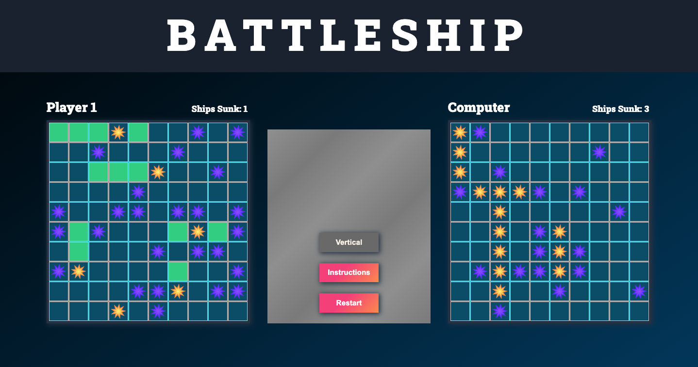

# Battleship - Test Driven Development

[Play Battleship](https://battleship-boom.netlify.app/)

## Description:

Embark on an exciting journey with this modern, browser-based adaptation of the classic Battleship game, developed as part of The Odin Project's esteemed curriculum. Players are invited to strategically position their ships on a grid and engage in thrilling battles as they take turns attacking the computer's fleet. The ultimate objective is to outmaneuver your rival by sinking all of their ships before they can do the same to yours.

Expertly crafted using HTML, CSS, and JavaScript, this project showcases prowess in creating a captivating and interactive gaming experience. Additionally, Bootstrap icons have been incorporated to provide a sleek and visually appealing interface.

Key Features:

- Intuitive and interactive user interface that allows for seamless ship placement and attack coordination on the opponent's grid.
- Effective implementation of factory functions and the module pattern, following The Odin Project's guidelines and best practices.
- Responsive design that ensures optimal gameplay across a variety of screen sizes and devices.
- Clear in-game messages and instructions to guide players through each stage of the game while providing real-time updates on the game state.
- Visually stunning color scheme and design elements that elevate the overall gaming experience.
- Utilization of Webpack's module bundling, complemented by comprehensive module tests via the Jest testing framework.
- Improved the AI opponent's attack strategy. When the AI scores a 'hit' on a player's ship, it is now more likely to target adjacent slots in subsequent turns. This change makes the AI opponent more challenging, as it can now more effectively locate and sink the player's ships.

Good luck, and enjoy the game!
